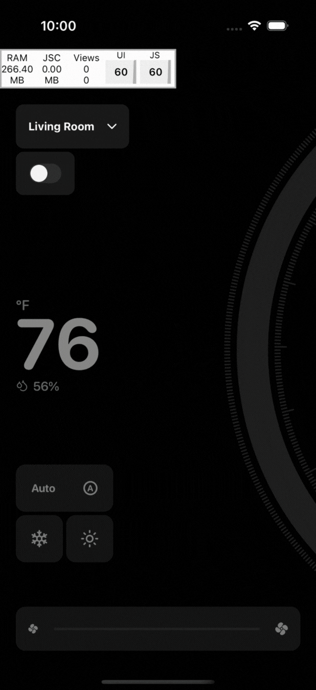

# Smart Thermostat Control App 🌡️

A modern React Native thermostat interface featuring smooth animations, gesture controls, and beautiful Skia-powered graphics. This demo app was inspired by the [Smart Thermostat Control design](https://dribbble.com/shots/25140139-Mobile-App-UI-Animation-for-Smart-Thermostat-Control) from Dribbble.

<div align="center">
  
</div>

## ✨ Features

- **Gesture-driven Circular Slider**: Interactive temperature control with smooth rotation gestures
- **Multi-room Support**: Independent temperature settings for 5 different rooms
- **Advanced Animations**: Powered by React Native Skia and Reanimated
- **Haptic Feedback**: Tactile responses for enhanced user experience
- **Custom Graphics**: Beautiful gradient circles, animated arcs, and expanding bubble effects
- **Mode Control**: Support for Cool, Heat, and Auto modes
- **Fan Speed Control**: Linear slider for fan speed adjustment
- **Responsive Design**: Optimized for various screen sizes

## 🎨 Design Inspiration

This project recreates the stunning thermostat UI from [this Dribbble shot](https://dribbble.com/shots/25140139-Mobile-App-UI-Animation-for-Smart-Thermostat-Control), featuring:
- Circular temperature slider with gradient fills
- Smooth room transitions with color animations
- Modern dark theme with vibrant accent colors
- Intuitive gesture-based controls

## 🚀 Tech Stack

- **React Native** (0.79.6) - Core framework
- **Expo** (~53.0.22) - Development platform
- **React Native Skia** (^2.2.4) - 2D graphics and custom drawing
- **React Native Reanimated** (~3.17.4) - High-performance animations
- **React Native Gesture Handler** (~2.24.0) - Advanced gesture recognition
- **React Native Animatable Text** (~0.16.0) - Update text values without React re-renders
- **Expo Haptics** - Tactile feedback
- **Lucide React Native** - Beautiful icons

## 📱 Installation & Setup

### Prerequisites

- Node.js (v18 or higher)
- Expo CLI
- iOS Simulator / Android Emulator or physical device

### Setup with Development Client

This app requires a custom development client due to native modules like `react-native-animateable-text` and `lucide-react-native`.

1. **Clone the repository**
   ```bash
   git clone <repository-url>
   cd thermostat
   ```

2. **Install dependencies**
   ```bash
   npm install
   ```

3. **Build and install development client**
   
   For iOS:
   ```bash
   npx expo run:ios
   ```
   
   For Android:
   ```bash
   npx expo run:android
   ```

4. **Start the development server**
   ```bash
   npm start
   ```

5. **Open in your custom dev client**
   - The app will automatically open in your newly built development client
   - For subsequent runs, just use `npm start` and scan the QR code with your dev client

> **Note**: This app will not work with Expo Go due to native module dependencies. A custom development client is required.

## 📄 License

This project is for demonstration purposes. Feel free to use and modify for your own projects.

## 🙏 Acknowledgments

- Original design inspiration: [Dribbble - Smart Thermostat Control](https://dribbble.com/shots/25140139-Mobile-App-UI-Animation-for-Smart-Thermostat-Control)
- React Native Skia team for the amazing graphics library
- React Native Reanimated team for smooth animations
- Expo team for the excellent development platform

## ☕ Support

If you found this project helpful and would like to support future development:

<a href="https://www.buymeacoffee.com/greenfrvr" target="_blank"></a>
---

Built with ❤️ using React Native, Skia, and Reanimated
